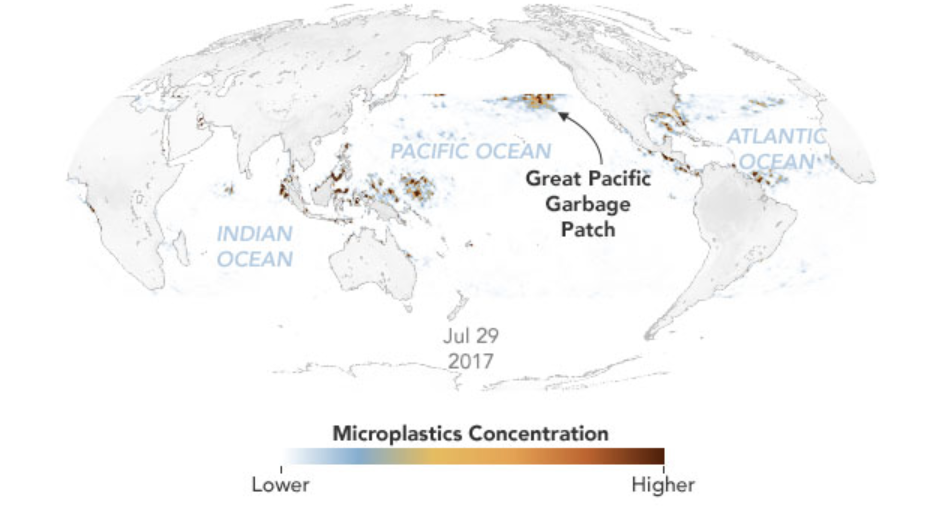

### About
Emily Cassidy is an environmental researcher and award-winning science writer. Her research has been featured in _National Geographic_, _Vox_, and _NBC News_. 
Currently, Emily is a science writer and contractor for NASA's Earth Science Data Systems Program. She writes about how NASA's Earth science data and changing cyberinfrastructure. 

---
### Writing

[cims]: https://caos.cims.nyu.edu/
[nyu]: https://cims.nyu.edu/
[gfdi]: https://gfdi.fsu.edu/
[bits]: https://www.bits-pilani.ac.in/Goa/

